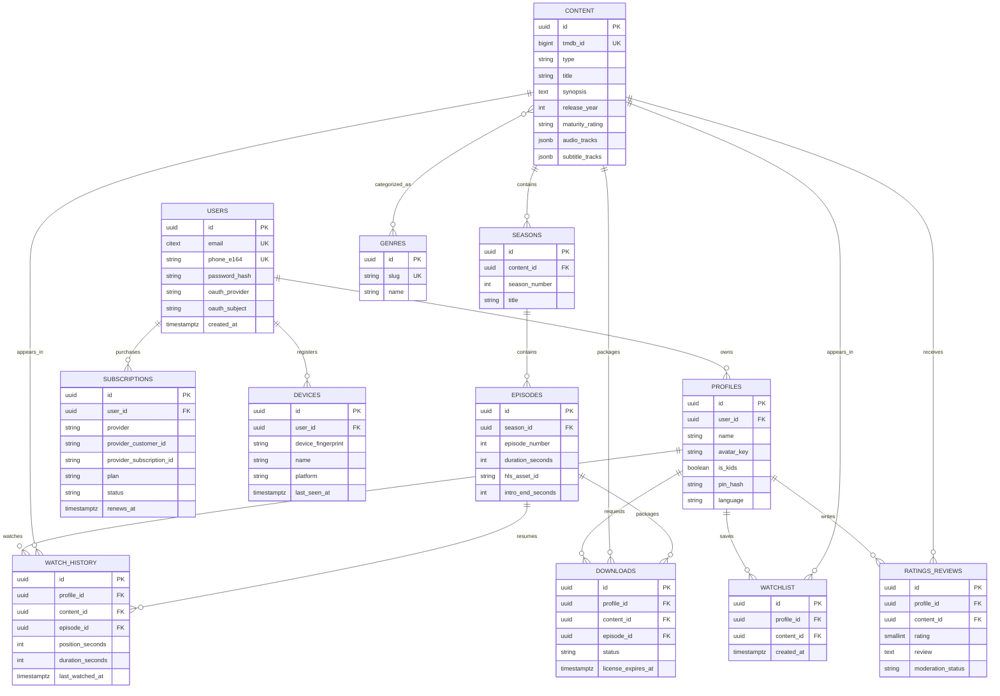

# Filmora Movie — Architecture and Delivery Notes

## 1. Existing-codebase decision

This repository is an existing **Astro 7 server-rendered application with React 19 islands**, not a greenfield Next.js project. Migrating it to Next.js would alter routing, rendering, deployment, and existing behavior, so this delivery keeps Astro and adds only isolated React/TypeScript functionality.

For a greenfield streaming product, **Next.js App Router** would be the recommendation because it combines SSR/SEO, route handlers, streaming server rendering, image optimization, and React code-splitting. For this codebase, Astro provides the same key SEO/server benefits while preserving the current application.

- Styling: keep component-scoped CSS. It makes `@media (max-width: 768px)` ownership explicit and avoids shared-selector leakage.
- Client state: use **Zustand** when cross-island player/session state is introduced. It is smaller and less procedural than Redux Toolkit for player, profile, watchlist, and preference state. Server data should remain server-fetched/cached rather than duplicated in a global client store.
- API style: use **REST**. Playback, progress, signed URLs, webhooks, and CDN operations map cleanly to resources and HTTP caching. GraphQL would add operational complexity without a current multi-client requirement.

## 2. Responsive audit and protected styling

Audit completed before adding the new UI. Existing breakpoints found across `src/styles`, pages, and components:

| Breakpoint | Existing use |
| --- | --- |
| `max-width: 380px` | very narrow navigation/cards |
| `max-width: 400px` | two-column mobile grids |
| `min-width: 480px` | footer/component expansion |
| `max-width: 600px` | compact footer behavior |
| `max-width: 639px` / `min-width: 640px` | mobile/listing and bento transitions |
| `max-width: 640px` | page/footer mobile rules |
| `max-width: 767px` / `min-width: 768px` | primary mobile/desktop boundary |
| `max-width: 768px` | existing mobile navigation effect |
| `min-width: 768px` to `max-width: 1023px` | tablet-only layer |
| `max-width: 900px` / `min-width: 900px` | gallery/contact/footer transitions |
| `max-width: 1023px` / `min-width: 1024px` | tablet/desktop navigation and layouts |
| `min-width: 1280px` | wide containers/cards |
| preference queries | reduced motion and increased contrast |

Protected shared selectors include:

- Foundations: `:root`, `html`, `body`, `main`, `.container`, `.page-top`, `.home-sections`.
- Controls: `.btn*`, `.input`, `.badge`, `.chip`, `.divider`, `.glass*`.
- Catalog: `.rail*`, `.scroll-rail`, `.poster-card*`, `.t10-*`.
- Navigation/footer: `.nav-*`, `.mobile-*`, `.btb-*`, `.footer-*`.
- Detail: `.detail-*`, `.trailer-wrap`, `.cast-*`, `.provider-*`, `.episode-*`.
- Listing/search: `.browse-*`, `.poster-grid`, `.pagination-*`, `.search-*`, `.people-grid`.
- Account/platform: `.watchlist-grid`, `.profiles-grid`, `.privacy-grid`, `.platform-*`.

The new feature does **not** edit `global.css` or `mobile.css`. It owns unique `nxm-*` selectors. Every `nxm-*` visual declaration is inside `@media (max-width: 768px)`, and the React island returns `null` when the viewport is wider than 768px. It shares an already-existing homepage wrapper so it introduces no empty desktop flex item or gap.

## 3. New custom add-on feature

### AI Mood Match + Time Available

Code comments label this as **Custom Add-on Features**. The mobile-only feature lets a user choose a mood and a 60/90/120/180-minute window.

1. `MoodMatch.tsx` sends only allow-listed mood/time values to `POST /api/mood`.
2. The API applies validation and per-instance rate limiting.
3. TMDB supplies real, runtime-filtered catalog candidates.
4. The server sends the candidates—not user identity or viewing history—to nexos.ai.
5. Nexos returns structured JSON selecting three IDs and short reasons.
6. IDs are checked against the supplied candidate set; generated IDs/titles are never trusted.
7. If Nexos is unavailable, unauthorized, out of credits, or malformed, the feature returns deterministic TMDB picks instead of breaking existing discovery.

The secret is read only as `import.meta.env.NexS_api`. It is never included in client code or responses.

## 4. Database ERD (target PostgreSQL model)

The current app uses SQLite for users, profiles, watchlist, ratings, and sessions. The production target should use PostgreSQL for durable domain data and Redis for sessions, rate limits, hot catalog caches, presence, and watch-progress write coalescing.



Add unique constraints for `(profile_id, content_id)` watchlist/rating rows and `(profile_id, content_id, episode_id)` progress. Keep refresh-token hashes and revocation state in a dedicated table or Redis—not plaintext tokens.

## 5. REST API map

### Current application

- `GET /api/search?q=` — TMDB autocomplete proxy.
- `GET|POST|DELETE /api/watchlist` — authenticated/default-profile watchlist.
- `POST|DELETE /api/rating` — profile rating.
- `GET /api/auth/google` and `GET /api/auth/google/callback` — OAuth.
- `POST /api/auth/signout` — session logout.
- `POST /api/mood` — new server-only Nexos + TMDB mood matching.

### Production target

- Auth: `POST /v1/auth/signup`, `/login`, `/refresh`, `/logout`, `/otp/request`, `/otp/verify`; `GET /v1/auth/oauth/:provider`.
- Profiles: `GET|POST /v1/profiles`; `PATCH|DELETE /v1/profiles/:id`; `POST /v1/profiles/:id/unlock`.
- Catalog: `GET /v1/content`, `/content/:id`, `/content/:id/related`, `/genres`, `/search/suggest`.
- Playback: `POST /v1/playback/:assetId/session` (signed HLS URL); `PUT /v1/progress/:contentId`; `GET /v1/progress/:contentId`; track/subtitle manifests.
- User library: `GET|POST|DELETE /v1/watchlist`; `GET|DELETE /v1/history`; ratings/reviews endpoints.
- Downloads: `POST /v1/downloads`, `GET /v1/downloads`, `DELETE /v1/downloads/:id`; web responses describe cache availability, not native files.
- Billing: plans, checkout session, customer portal, and idempotent Stripe/Razorpay webhook endpoints.
- Devices/settings: `GET|DELETE /v1/devices`; `GET|PATCH /v1/preferences`; parental PIN endpoints.
- Notifications: preferences and Web Push subscription endpoints.
- Admin: RBAC-protected content ingest, publish, moderation, and observability endpoints.
- Custom add-ons: mood/time match, party room/token, playlist CRUD/share, trivia timeline, and creator spotlight endpoints.

Use Zod/Valibot request schemas, idempotency keys for billing/download jobs, Redis-backed distributed limits, and RFC 9457 problem responses.

## 6. Screen and route map

### Existing routes

- `/` discovery; `/movies`, `/series`, `/anime`, `/search` catalog.
- `/movie/:id`, `/series/:id` details.
- `/netflix`, `/prime`, `/disney`, `/hotstar`, `/appletv` provider discovery.
- `/watchlist`, `/profile`, `/login` user flows.
- `/about`, `/contact`, `/privacy`, `/terms`, `/404`, `/500` static/system routes.

### Target additions

- `/watch/:assetId` HLS player.
- `/profiles`, `/profiles/:id/edit`, `/plans`, `/account`, `/settings`, `/devices`.
- `/history`, `/downloads`, `/notifications`, `/parental-controls`.
- `/party/:roomId`, `/playlists/:slug`, `/spotlight/:personSlug`.
- Mood Match is embedded in mobile discovery rather than adding a navigation route.

## 7. Mobile-only seamless design system

Within `max-width: 768px` only:

- Hierarchy comes from 11px uppercase eyebrow text, 22–28px headings, 14px body text, opacity, and 8/12/16/24px spacing rhythm.
- Sections use transparent/shared backgrounds. Result rows use a subtle surface tint, not outlines.
- No dividers, card borders, or box shadows are used by Mood Match.
- Selection uses filled backgrounds and text contrast—not strokes.
- Controls are at least 44px; the primary action is 50px.
- `aria-pressed`, fieldset/legend labels, `aria-live`, meaningful link labels, lazy images, and visible keyboard focus are included.
- Reduced-motion behavior is explicitly scoped to the mobile feature.

Desktop ≥1024px and tablet 769–1023px remain frozen. No shared/base selector was added or modified for this feature.

## 8. Video delivery pipeline

1. Upload source to a private S3-compatible ingest bucket.
2. Validate file, malware-scan, and enqueue a transcode job.
3. Use Mux or AWS MediaConvert for 360p/480p/720p/1080p/4K HLS renditions, audio tracks, captions, thumbnails, and intro markers.
4. Store immutable HLS segments/manifests in private object storage.
5. Deliver through CloudFront/Mux CDN with short-lived signed cookies or URLs.
6. Player requests a playback session after entitlement/device checks; never expose origin credentials.
7. Send progress in throttled batches to Redis and persist checkpoints to PostgreSQL.

Do not build a custom transcoder. Use `hls.js` where Media Source Extensions are available and native HLS on Safari. PiP, Cast, and AirPlay must be capability-detected.

## 9. Recommendations

Start rule-based: profile maturity rules → language/region → unfinished history → genre affinity → recency/popularity → diversity/deduplication. Cache candidate sets in Redis and record impression/click/play events. Later replace only the ranking stage with embeddings or a learned ranker; keep eligibility, parental controls, and business rules deterministic.

The Nexos mood feature is a bounded reranker over real TMDB candidates. It does not let an LLM invent catalog records.

## 10. Security and operations

- Keep TMDB, Nexos, OAuth, billing, signing, and storage keys server-side in managed secrets.
- Apply Redis rate limiting, CSRF protection for cookie-authenticated mutations, strict CORS, secure/HTTP-only/SameSite cookies, short access tokens, rotating refresh tokens, and device/session revocation.
- Sign playback URLs for minutes, bind entitlement claims, and prevent origin bucket access.
- Validate all external AI output and allow-list model-selected IDs.
- RBAC admin APIs, audit billing/content actions, verify webhook signatures, redact logs, and set spend limits for AI calls.

## 11. Folder structure

```text
apps/
  web/                       # Next.js for greenfield; current repo remains Astro
    src/app/                 # routes/server components
    src/components/          # feature + UI components
    src/stores/              # Zustand client state
    src/lib/                 # API clients, validation, auth helpers
    public/                  # manifest/icons/service worker output
  api/
    src/modules/
      auth/ profiles/ catalog/ playback/
      watchlist/ history/ billing/ notifications/
      recommendations/ parties/ playlists/
    src/middleware/
    src/jobs/
packages/
  contracts/                 # schemas and generated API types
  design-tokens/
  observability/
infrastructure/
  terraform/                 # CDN, storage, DB, Redis, queues
```

Current implementation locations:

```text
src/components/react/MoodMatch.tsx  # mobile-only island
src/pages/api/mood.ts               # Nexos/TMDB server endpoint
src/pages/index.astro               # existing wrapper integration
.env                                # ignored NexS_api secret
.env.example                        # placeholder only for NexS_api
```

## 12. PWA and honest web limitations

The existing web manifest supports install metadata, but a complete installable/offline PWA also needs a service worker, offline shell, update strategy, and cache-size/expiry controls.

**A web app cannot provide true native-level protected offline downloads or full OS-level casting parity.** Service workers can cache previously streamed segments within browser quotas, but storage can be evicted and DRM/background behavior varies. Chromecast requires the Google Cast Web Sender SDK and compatible receivers; AirPlay is primarily exposed by Safari/native media controls. Treat browser-cached playback as limited offline convenience, not a guaranteed download manager.

## 13. Delivery order

1. Freeze/audit shared selectors and document mobile hierarchy (completed).
2. Add server API boundary, validation, secret handling, and catalog integration (Mood Match completed; broader auth/content target documented).
3. Add one mobile-only screen/component at a time, with every visual rule inside ≤768px and no shared-selector edits.
4. Validate at 320/375/390/480/768px and confirm 769/1024/1440 snapshots are unchanged.
5. Add remaining Custom Add-on Features last: parties, trivia/X-ray, playlists, and creator spotlights.
